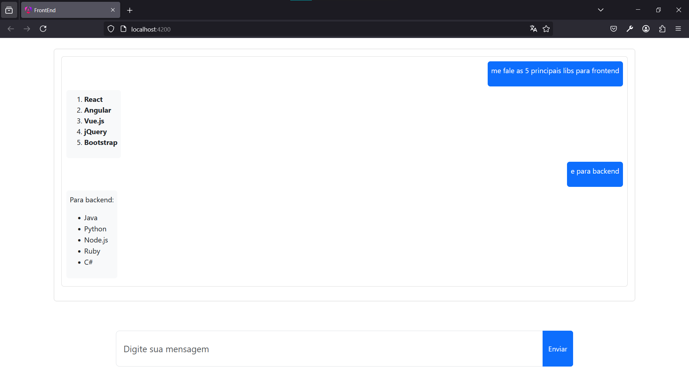

# Chatbot Fullstack com .NET, Angular e Google Gemini

Este projeto é um chatbot completo que combina um backend em .NET, um frontend em Angular e a tecnologia de IA do Google Gemini para processar e responder mensagens de forma inteligente.

## Funcionalidades

- Interação com usuários por meio de um chatbot responsivo.
- Backend em .NET para processar as mensagens.
- Frontend em Angular para interface do usuário.
- Integração com Google Gemini para processamento de linguagem natural.

## Tecnologias Utilizadas

- **Backend**: .NET (C#)
- **Frontend**: Angular
- **IA**: Google Gemini (Generative AI)


## Pré-requisitos

- [.NET SDK](https://dotnet.microsoft.com/)
- [Node.js](https://nodejs.org/)
- [Angular CLI](https://angular.io/cli)
- API Key do Google Gemini

## Configuração e Execução

### Backend

1. Navegue para a pasta do backend:
   ```bash
   cd backend
   ```

2. Configure o arquivo `.env` para adicionar a API Key do Google Gemini:
   ```env
   GEMINI_KEY=suachave
      ```

3. Inicie o servidor backend:
   ```bash
   dotnet run
   ```

4. O backend estará disponível em: `http://localhost:5102`.

### Frontend

1. Navegue para a pasta do frontend:
   ```bash
   cd frontend
   ```

2. Instale as dependências:
   ```bash
   npm install
   ```

3. Inicie o servidor de desenvolvimento:
   ```bash
   ng serve
   ```

4. Acesse o frontend em: `http://localhost:4200`.



## Licença

Este projeto está sob a licença [MIT](LICENSE).
